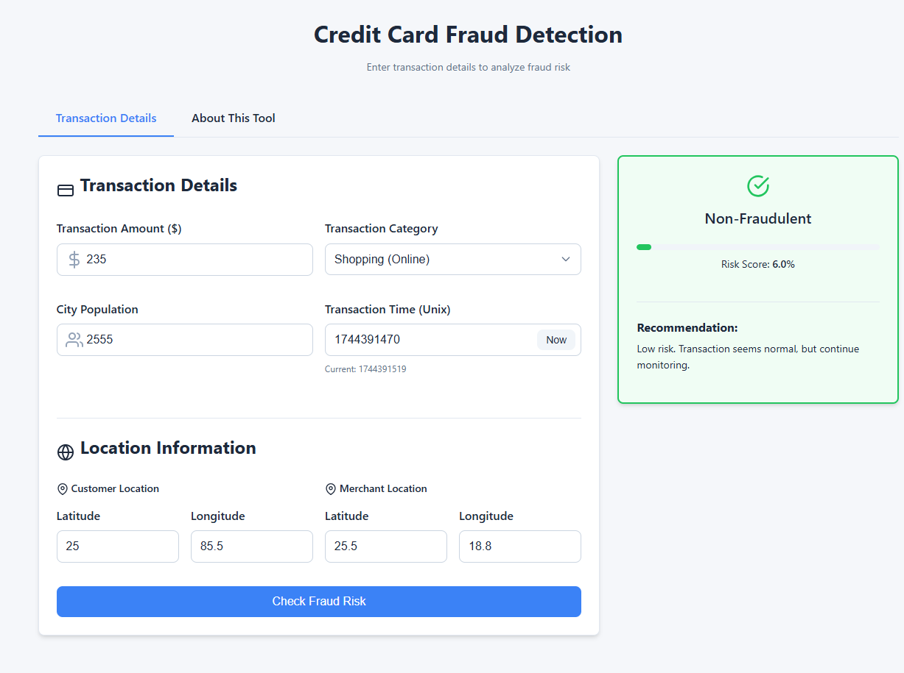
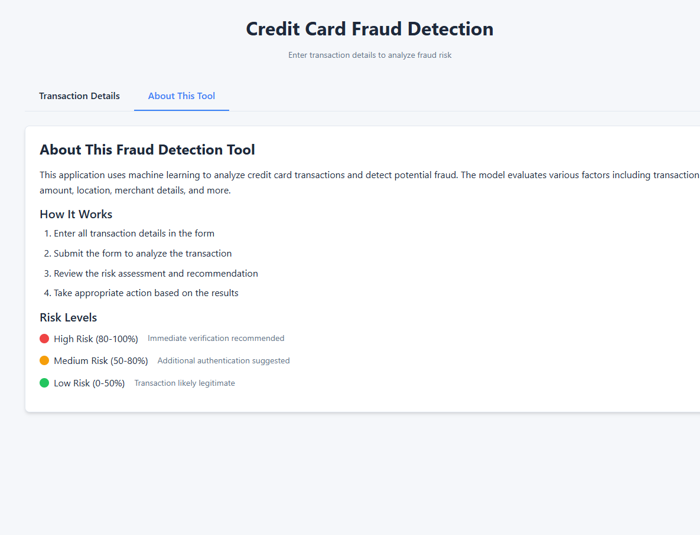
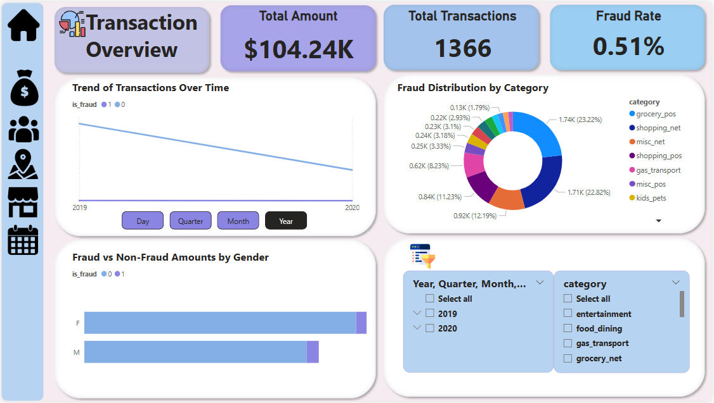
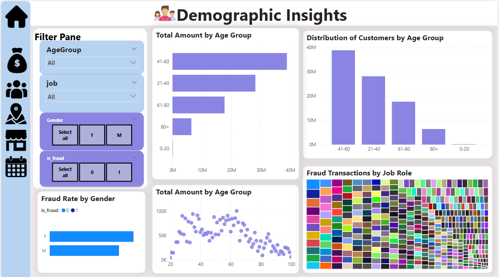
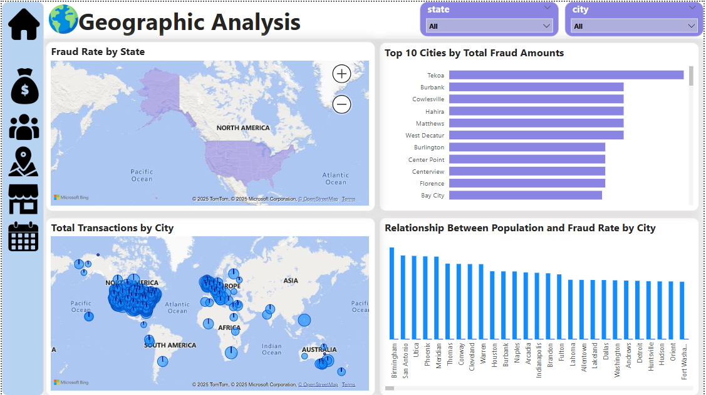
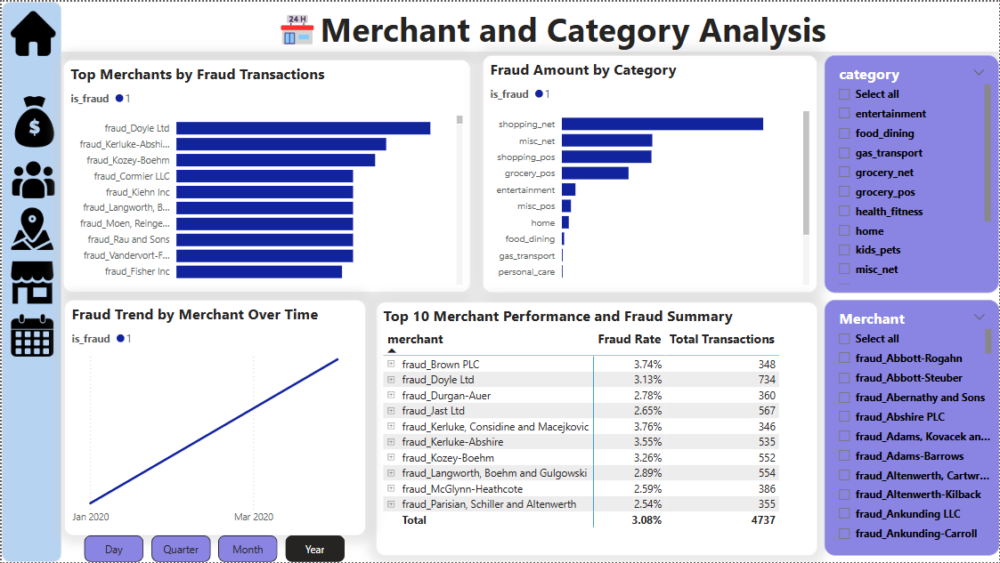
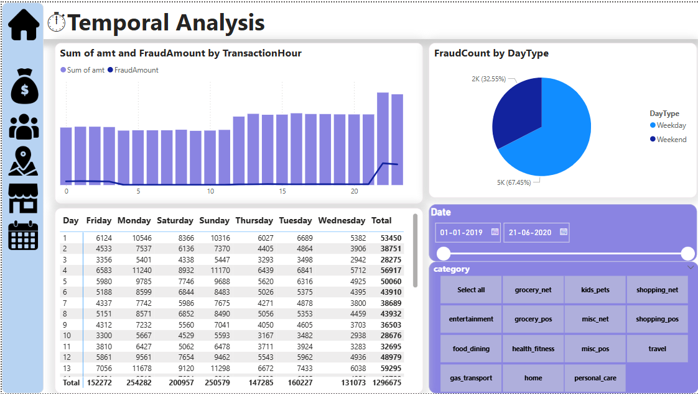

---

# 💳 Credit Card Fraud Detection

🔍 **About the Project**  
This project leverages **Machine Learning** for real-time fraud detection and **Power BI** for dynamic visualizations. It aims to help financial institutions reduce losses and enhance trust by quickly identifying fraudulent transactions.

---

## 🚀 Features

- 🔗 Real-time fraud detection with ML models  
- 📊 Interactive Power BI dashboards for fraud analytics  
- 🧠 Pretrained ML model with pipeline and hyperparameter tuning  
- 🌐 Web UI hosted with **Render** for user interaction  
- 📂 Organized project structure for reproducibility

---

## 🗂️ File Structure

```
📁 credit-card-fraud-detection/
│
├── 📂 data
│   ├── fraudTest.csv
│   └── fraudTrain.csv
│
├── 📂 images
│   ├── 1.png                     # UI homepage
│   ├── 2.png                     # UI transactions page
│   ├── transaction_overview.png
│   ├── demographic_insights.png
│   ├── geographic_analysis.png
│   ├── merchant_category.png
│   ├── temporal_analysis.png
│
├── 📂 models
│   ├── best_fraud_detection_model.pkl
│   ├── best_fraud_detection_modell.pkl
│   └── best_fraud_detection_pipeline1.1.pkl.bz2
│
├── 📂 notebooks
│   ├── Test.ipynb
│   ├── TryFinal.ipynb
│   └── TryFinal - Copy.ipynb
│
│
├── 📂 templates
│   └── index.html
│
├── app.py
├── LICENSE
├── requirements.txt
├── Projectppt.pptx
└── README.md
```

---

## 📊 Live Dashboard

🔗 **NovyPro**: [Power BI NovyPro Dashboard](https://www.novypro.com/project/credit-card-fraud-detection-dashboard-kirtan)  
🔗 **Power BI Live**: [Live Power BI Dashboard](https://app.powerbi.com/groups/me/reports/fraud-dashboard-id)  
🌐 **Render UI**: [Live Web App on Render](https://fraud-ui-app.onrender.com)

---

## 🗂️ Workflow

1. 🧹 **Data Preprocessing**  
   - Handled missing values  
   - Standardized and encoded features  

2. 🔍 **Exploratory Data Analysis (EDA)**  
   - Transaction trends  
   - High-risk locations and categories  

3. 🤖 **Model Training**  
   - Logistic Regression  
   - Decision Tree  
   - Random Forest (Best Performing)  
   - Gradient Boosting  
   - Model evaluated on F1 Score, Precision, Recall  

4. 🌐 **Web Application**  
   - Built with FastAPI + HTML/CSS  
   - Rendered predictions dynamically via API  

5. 📊 **Visualization**  
   - Power BI dashboard with dynamic filtering  
   - Fraud vs. Legit analysis per platform and category  

---

## 📄 Dataset

- **Source**: [Kaggle - Fraud Detection Dataset](https://www.kaggle.com/datasets/kartik2112/fraud-detection/data)  
- **Details**:  
  - 1,296,675 transactions from 1,000 customers (2019–2020)  
  - Labeled as fraudulent or legitimate  
  - Features: amount, location, category, time, etc.  

---

## 💻 How to Use

### 1. Clone the Repository
```bash
git clone https://github.com/sonikirtan110/credit-card-fraud-detection.git
cd credit-card-fraud-detection
```

### 2. Install Dependencies
```bash
pip install -r requirements.txt
```

### 3. Run the ML Model
Use Jupyter Notebook:
```bash
jupyter notebook
```
or run the pipeline from script:
```bash
python app.py
```

### 4. Explore the Dashboard  
Open `.pbix` file locally or explore the hosted version on NovyPro or Power BI Live.

---

## 🖼️ Project Visualizations

### 🏠 UI Preview:
| Home | Transaction |
|------|-------------|
|  |  |

### 📊 Power BI Visuals:

#### Transaction Overview:


#### Demographic Insights:


#### Geographic Analysis:


#### Merchant & Category Analysis:


#### Temporal Analysis:


---

## 📈 Best Model Performance (Random Forest)

| Metric      | Score    |
|-------------|----------|
| Accuracy    | 0.9959   |
| ROC-AUC     | 0.9920   |
| Precision   | 0.9990   |
| Recall      | 0.9969   |
| F1-Score    | **0.9979** |

---

## 📜 License

Licensed under the MIT License.  
Use, modify, and share freely.

---

## 🤝 Contributions

- Suggestions and PRs welcome!
- Open issues for bugs or feature requests.

---

## 📬 Contact

**👤 Kirtan Soni**  
📧 Email: [sonikirtan2004@gmail.com](mailto:sonikirtan2004@gmail.com)  
🔗 LinkedIn: [linkedin.com/in/kirtansoni02](https://www.linkedin.com/in/kirtansoni02)

---

⭐ **If you liked this project, give it a star on GitHub!**

---

Let me know if you'd like the actual `.md` file download or help deploying the dashboard/UI links.
