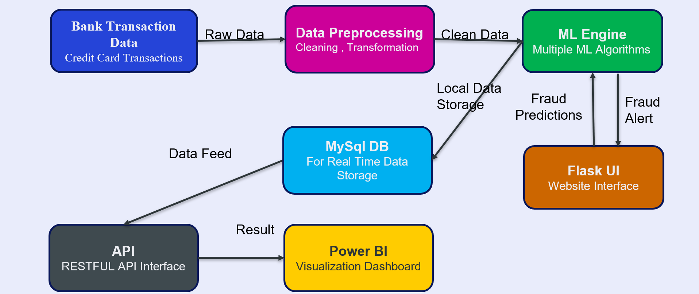
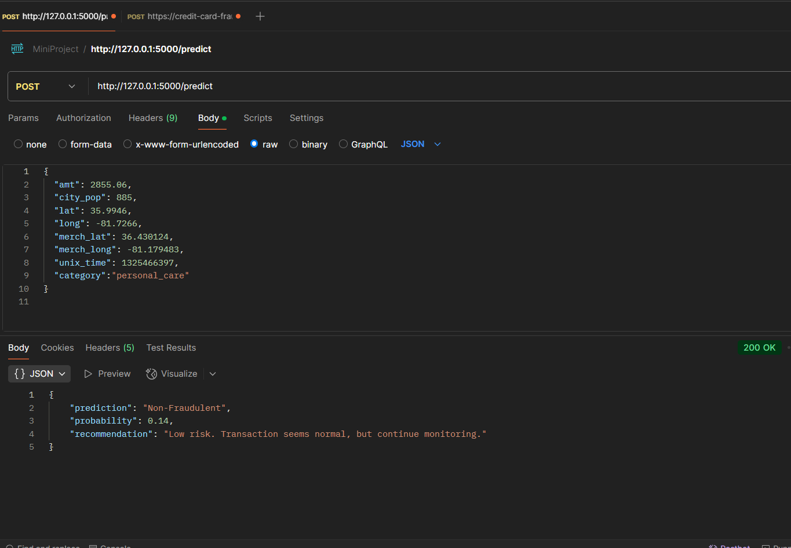
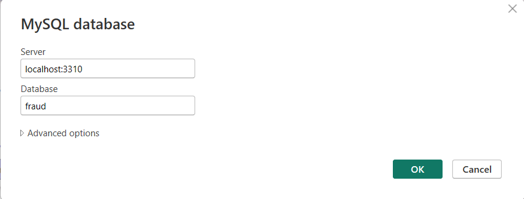

# 💳 Credit Card Fraud Detection

🔍 **About the Project**  
This project is a full-fledged machine learning pipeline designed for the real-time detection of credit card frauds. It integrates multiple components including machine learning models, REST APIs, local database storage, and data visualization tools such as Power BI. The goal is to enable fast, accurate, and interpretable fraud detection that can be deployed in financial systems.

This project includes:
- A robust Flask API for transaction classification
- Integration with MySQL to store prediction logs
- Power BI dashboards that visualize fraud trends in real-time (locally)
- A user-friendly UI hosted on Render for manual transaction input
- Fully tuned ML models using GridSearchCV for optimal accuracy

---

## 🚀 Features

- 🔗 Real-time fraud detection with multiple machine learning models
- 🧠 Optimized ML models using GridSearchCV for parameter tuning
- 💾 Local MySQL database to store incoming transaction predictions
- 📊 Visual analytics using Power BI connected directly to MySQL
- 🌐 Web-based user interface (HTML/CSS + Flask) for easy data entry
- 📮 RESTful API tested with Postman
- 📁 Modular project layout for easy understanding and expansion

---

## 📁 Project Structure

```credit-card-fraud-detection/
├── app.py                 # Main Flask web app serving the UI and predictions
├── appsql.py              # Alternate Flask app using MySQL to store results
├── config.py              # Configuration file containing MySQL credentials
├── sql/                   # SQL scripts for setting up the database
│   ├── create_table.sql   # SQL command to create fraud_logs table
│   └── data.sql    # Sample insert statements to test the table
├── models/                # Serialized models after training
│   ├── best_fraud_detection_model.pkl
│   └── best_fraud_detection_pipeline1.1.pkl.bz2
├── notebooks/             # Jupyter Notebooks used during model building
│   ├── TryFinal.ipynb     # Full training/testing pipeline
│   └── TryFinalTunning.ipynb # GridSearchCV and tuning
├── templates/             # HTML files for the Flask UI
│   └── index.html         # Homepage for data entry
├── images/                # Project screenshots
│   ├── 1.png                          # Home page screenshot
│   ├── 2.png                          # About page screenshot
│   ├── flow_diagram.png              # System architecture flow
│   ├── postman_test.png              # Postman test example
│   ├── mysql_connection.png          # MySQL config in Power BI
│   ├── powerbi_mysql.png             # Power BI table preview
│   ├── transaction_overview.png      # Dashboard 1
│   ├── demographic_insights.png      # Dashboard 2
│   ├── geographic_analysis.png       # Dashboard 3
│   ├── merchant_category.png         # Dashboard 4
│   └── temporal_analysis.png         # Dashboard 5
├── requirements.txt       # Python libraries used
├── Projectppt.pptx        # Final presentation slides
└── README.md              # Project documentation

```

---

## 🔧 Setup & Installation

### 1. Clone Repository
```bash
git clone https://github.com/sonikirtan110/credit-card-fraud-detection.git
cd credit-card-fraud-detection
```

### 2. Install Dependencies
```bash
pip install -r requirements.txt
```

### 3. Configure MySQL
Update `config.py` as shown:
```pythonDB_CONFIG = {
    'host': 'localhost',
    'user': 'root',
    'password': '1978',
    'database': 'fraud',
    'port': 3310,  # Updated port
    'auth_plugin': 'mysql_native_password'
}
```

### 4. Initialize Database
Run the following commands:
```bash
mysql -u root -p < sql/create_table.sql
mysql -u root -p < sql/data.sql
```

### 5. Run the Flask App
```bash
python app.py
```
Visit: [http://127.0.0.1:5000](http://127.0.0.1:5000)

---

## 📊 Dashboards (Local Power BI)
Power BI is used **locally** to visualize fraud data from MySQL.

Steps:
1. Open Power BI Desktop → "Get Data" → "MySQL"
2. Enter your MySQL credentials
3. Select the `fraud_transactions` table
4. Build visuals such as:
   - Count of fraud vs non-fraud transactions
   - Demographic-based filtering
   - Fraud trends by date/time
   - Merchant category fraud reports

---

## 🧪 API Testing

Use **Postman** to send test requests:
```json
POST http://127.0.0.1:5000/predict
{
 "amt": 281.06,
  "city_pop": 885,
  "lat": 35.9946,
  "long": -81.7266,
  "merch_lat": 36.430124,
  "merch_long": -81.179483,
  "unix_time": 1325466397,
  "category":"grocery_pos"
}
```

To confirm data is being logged, run:
```sql
SELECT * FROM fraud_transactions;
```

You’ll see real-time logs of each prediction made by the model.

---

## 🖼️ Visuals

**📊 System Flow Diagram**  
Shows data flow from user to model to MySQL to Power BI.  


**📮 Postman API Test**  
Sample request and successful JSON response.  


**🔌 MySQL - Connection Setup (Power BI)**  
How the database is linked with Power BI.  


**📈 Power BI - MySQL Table View**  
Fraud logs live in Power BI dashboards.  


**🖥️ Flask UI - Home**  
User interface for entering transaction data.  


**🧾 Flask UI - About**  
Describes the app functionality.  


**💹 Transaction Overview**  
Fraud vs Legit overview.  


**🧍 Demographic Insights**  
Gender, age-based fraud ratios.  


**🗺️ Geographic Analysis**  
Region-wise fraud spread.  


**🏪 Merchant Category Analysis**  
Which merchants are more targeted.  


**⏱️ Temporal Analysis**  
Fraud rate vs time of day/week.  


---

## 📈 Model Performance

| Metric      | Score    |
|-------------|----------|
| Accuracy    | 0.9959   |
| ROC-AUC     | 0.9920   |
| Precision   | 0.9990   |
| Recall      | 0.9969   |
| F1-Score    | **0.9979** |

> Model: Random Forest with balanced class weights and 200 trees.

---

## 📜 License
Apache 2.0 — You’re free to use, modify, and distribute with attribution.

---

## 📬 Contact
**Kirtan Soni**  
📧 sonikirtan2004@gmail.com  
🔗 [LinkedIn](https://www.linkedin.com/in/kirtansoni02)

---

⭐ If you like this project, please star the repository and share!

